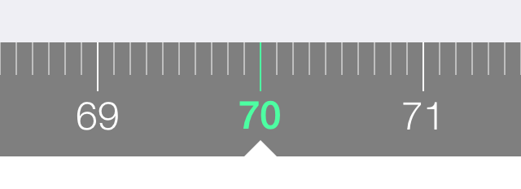

# ios-NumberRangeSelector

Granular selection from a numeric range for iOS. 

This control is useful whenever you need to select from a range and can therefore be used as a replacement for UISlider and UIPickerView. 
The original usecase was the weight entry for the app *Weightely*.

## Installation
Install the *ios-NumberRangeSelector* Cocoapod.

Alternatively, copy the `.h` and `.m`  files into your project, and either install the [objc-utils](https://github.com/mruegenberg/objc-utils) Cocoapod or copy the `UIColor+HelperAdditions` and `NSObject+ObserveActions` categories from there into your project. 

## License
MIT.

## Screenshot

## Build status
